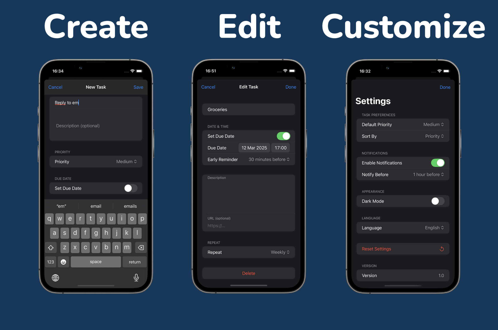
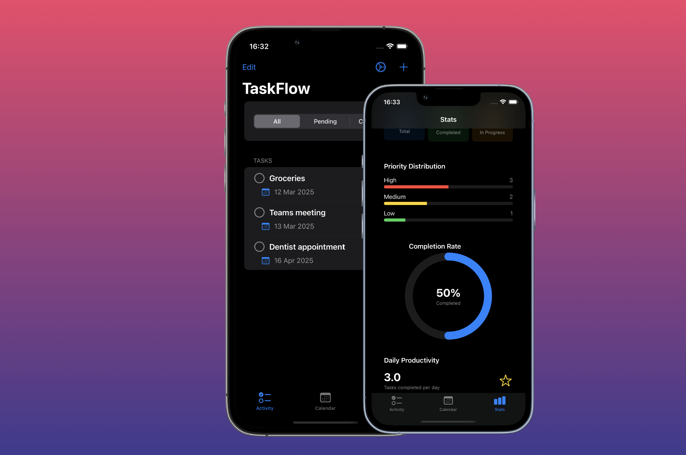

# TaskFlow

### Inspired by Apple's Reminders app, this project was built entirely with SwiftUI. It provides task management with local notifications, Core Data for data persistence, and multilingual support. Users can create, edit, and organize reminders with customizable deadlines.

